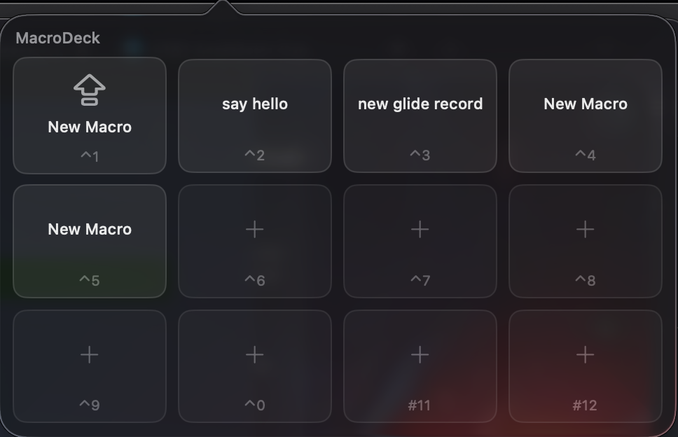
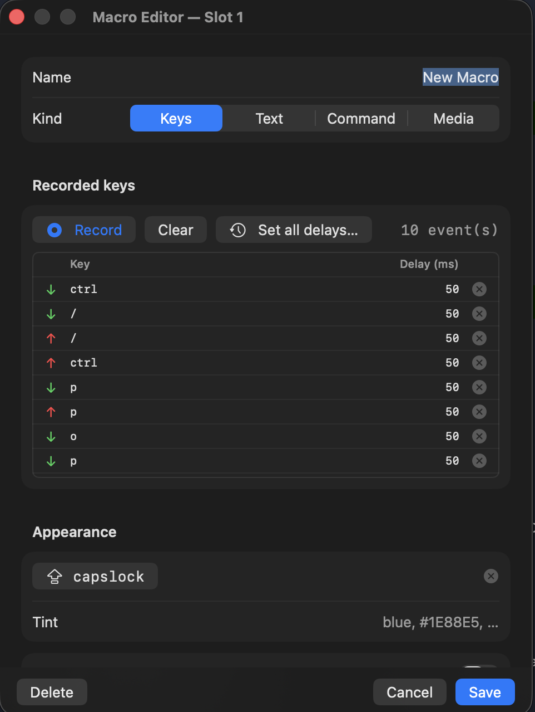

# MacroDeck

A Stream Deck–style macro launcher for macOS. Lives in the menu bar, fires user-defined macros from a popover grid.

<p align="center">
  
  &nbsp;
  
</p>

> Native Swift / SwiftUI menu bar app. Real `NSVisualEffectView` vibrancy via `NSStatusItem` + `NSPopover`, SF Symbols, continuous corners, recorded-key playback with proper modifier flags.

## Features

- **Native menu bar popover** with real macOS vibrancy
- **Four macro kinds**:
  - **Keys** — recorded press/release sequence, replayable with editable per-event delays
  - **Text** — type a snippet of text (multi-line)
  - **Command** — run a shell command
  - **Media** — vol/mute/play/next/prev/brightness, fires the real HUD + tink
- **SF Symbol icons** with optional tint colour, picked from a searchable grid
- **Global hotkeys** — `⌃1`–`⌃0` runs the macro in that slot; `⌃⇧M` toggles the popover
- **Per-macro "keep popup open"** for rapid-fire actions
- **Auto-starts at login** via a LaunchAgent

## Install

```
bash install.sh
```

Builds via `xcodebuild`, installs to `~/Applications/MacroDeck.app`, ad-hoc signs, registers the LaunchAgent.

First launch needs **Accessibility** (key playback) and **Input Monitoring** (recording + global hotkeys, when those land). Grant both in System Settings → Privacy & Security, then restart MacroDeck (the LaunchAgent will respawn it automatically).

Logs: `~/.mac-macro/macrodeck.log`
Data: `~/.mac-macro/macros.json` and `~/.mac-macro/settings.json`

## Uninstall

```
bash uninstall.sh
```

## Requirements

- macOS 14 or later (built and tested on Apple Silicon, macOS 26)
- Xcode 15+ (for `xcodebuild`)

## Project layout

| Path | Purpose |
|---|---|
| `MacroDeck.xcodeproj` | Xcode project — open this to develop |
| `MacroDeck/MacroDeckApp.swift` | `@main` SwiftUI App with `MenuBarExtra` |
| `MacroDeck/Models/` | `Macro`, `MacroStore`, `Settings` (JSON-compatible with v1) |
| `MacroDeck/Views/` | `PopupView`, `MacroTile`, `VibrancyView` |
| `MacroDeck/Engine/` | `Player`, `MediaKey`, `Permissions`, `KeyMap` |
| `install.sh` / `uninstall.sh` | Build with `xcodebuild`, install, register LaunchAgent |

## macros.json format

```json
{
  "1": {
    "id": "uuid",
    "name": "POP",
    "kind": "text",         // keys | text | cmd | media
    "text": "PoP",
    "cmd": "",
    "media": "",             // vol_up | vol_down | mute | play_pause | next | prev | brightness_up | brightness_down
    "events": [],            // recorded key events for kind=keys
    "symbol": "bolt.fill",   // SF Symbol name
    "tint": "blue",          // named ("red", "blue", ...) or hex ("#1E88E5")
    "keep_open": false
  }
}
```
